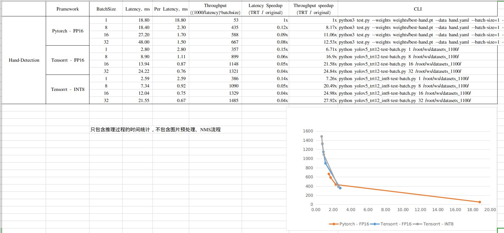

## 进入docker环境

```bash
docker run --gpus all -it --rm -v /root/ws/:/root/ws/ nvcr.io/nvidia/pytorch:20.11-py
```

## 进到工程目录

`cd ~/ws/tensorrtHack2_1`

## 模型导出

不同设备环境，需要重新导出engine文件
`python3 resnet50_demo.py -s`

### yolov5模型导出

`./yolov5 -s yolovs-hand.wts yolov5s-hand.engine s`

### yolov5-int8优化模型导出

`./yolov5 -s yolov5s-hand-int8.wts yolov5s-hand-int8.engine s`

## 测试结果

测试没有优化的模型
`python yolov5_trt12.py`
测试int8量化的模型
`python yolov5_trt12_int8.py`

## 模型文件地址

链接: https://pan.baidu.com/s/1QaKLq4q-FRbuCl0asEJ9hg 提取码: qrtc

## Benchmark

- 运行Pytorch-FP16测试基准

```bash
# Pytorch - FP16 - batch_size = 1
python3 test.py --weights weights/best-hand.pt --data hand.yaml --batch-size=1 --img-size 1
# Pytorch - FP16 - batch_size = 8
python3 test.py --weights weights/best-hand.pt --data hand.yaml --batch-size=1 --img-size 8
# Pytorch - FP16 - batch_size = 16
python3 test.py --weights weights/best-hand.pt --data hand.yaml --batch-size=1 --img-size 16
# Pytorch - FP16 - batch_size = 32
python3 test.py --weights weights/best-hand.pt --data hand.yaml --batch-size=1 --img-size 32
```

- 运行Tensorrt-FP16测试基准

```bash
# Tensorrt - FP16 - batch_size = 1
python yolov5_trt12-test-batch.py 1 /root/ws/datasets_1100/
# Tensorrt - FP16 - batch_size = 8
python yolov5_trt12-test-batch.py 8 /root/ws/datasets_1100/
# Tensorrt - FP16 - batch_size = 16
python yolov5_trt12-test-batch.py 16 /root/ws/datasets_1100/
# Tensorrt - FP16 - batch_size = 32
python yolov5_trt12-test-batch.py 32 /root/ws/datasets_1100/
```

- 运行Tensorrt-FP8测试基准

```bash
# Tensorrt - INT8 - batch_size = 1
python yolov5_trt12_int8-test-batch.py 1 /root/ws/datasets_1100/
# Tensorrt - INT8 - batch_size = 8
python yolov5_trt12_int8-test-batch.py 8 /root/ws/datasets_1100/
# Tensorrt - INT8 - batch_size = 16
python yolov5_trt12_int8-test-batch.py 16 /root/ws/datasets_1100/
# Tensorrt - INT8 - batch_size = 32
python yolov5_trt12_int8-test-batch.py 32 /root/ws/datasets_1100/
```

**结果输出如下：** [Excel文件下载](./benchmark.xlsx)



